# Anleitung
*The English version of the instructions can be found here: [English version](Instructions_en.md)*  
Du willst Dich für ein Stüble anmelden? 
Dann findest Du hier die Anleitung 📄 dazu.  

## Übersicht
[1. Registrierung](#registrierung) 
[2. Zum Stüble anmelden](#zum-stüble-anmelden) 
[3. Freund*in einladen](#freundin-einladen) 
[4. Vom Stüble abmelden](#vom-stüble-abmelden) 
[5. Einlass](#einlass) 
[6. Einstellungen](#einstellungen) 
[7. Kontakt](#kontakt)

## Registrierung
Um Dich für ein Stüble anzumelden, musst Du zuerst einen Benutzeraccount erstellen.  
Wie das geht, zeigen wir Dir hier.

1. Besuche die Stüble-Website [Stüble-Registrierung](https://stueble.pages.dev) und klicke auf Registrieren.

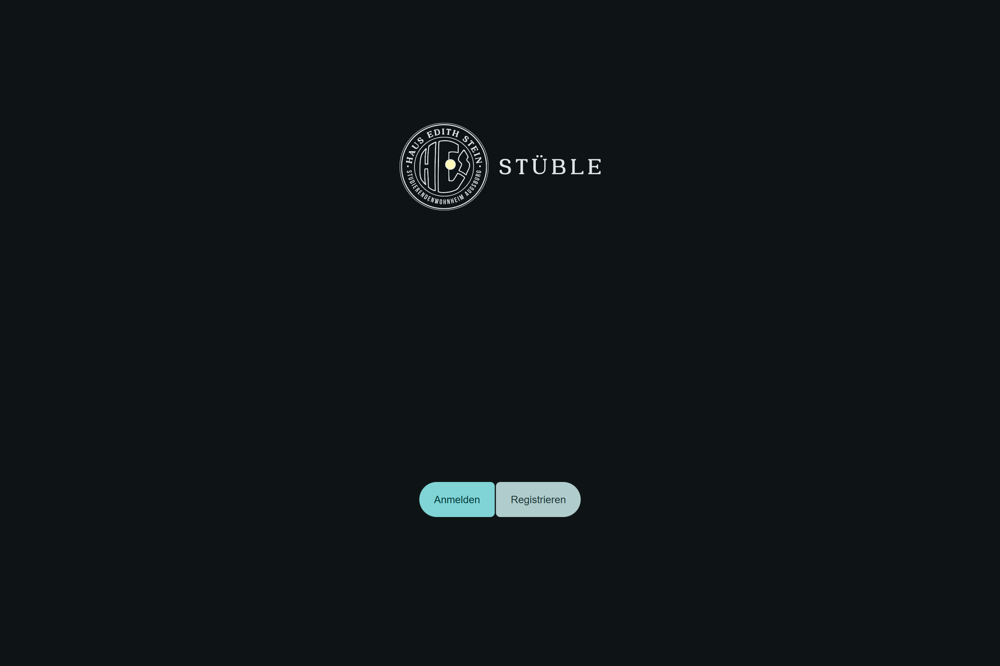
  
2. Gib Deine Daten ein und stimme den [Nutzungsbedingungen](#nutzungsbedingungen) zu. Achte darauf, dass die Daten korrekt sind. 
Anschließend klicke auf Registrieren.

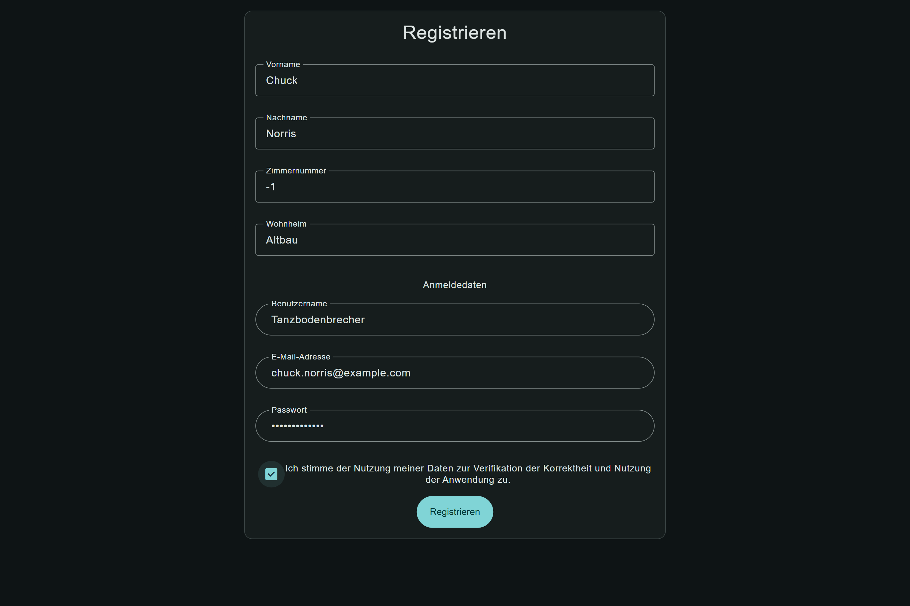  
3.1 Nun wird Dir eine Email von stuebleheshirte@gmail.com zugesendet.

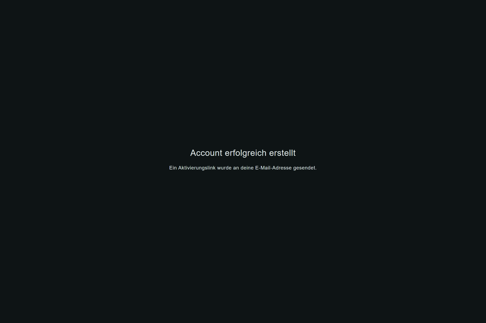  
3.2
Um Deine Email-Adresse zu verifizieren, klicke bitte auf Email bestätigen.

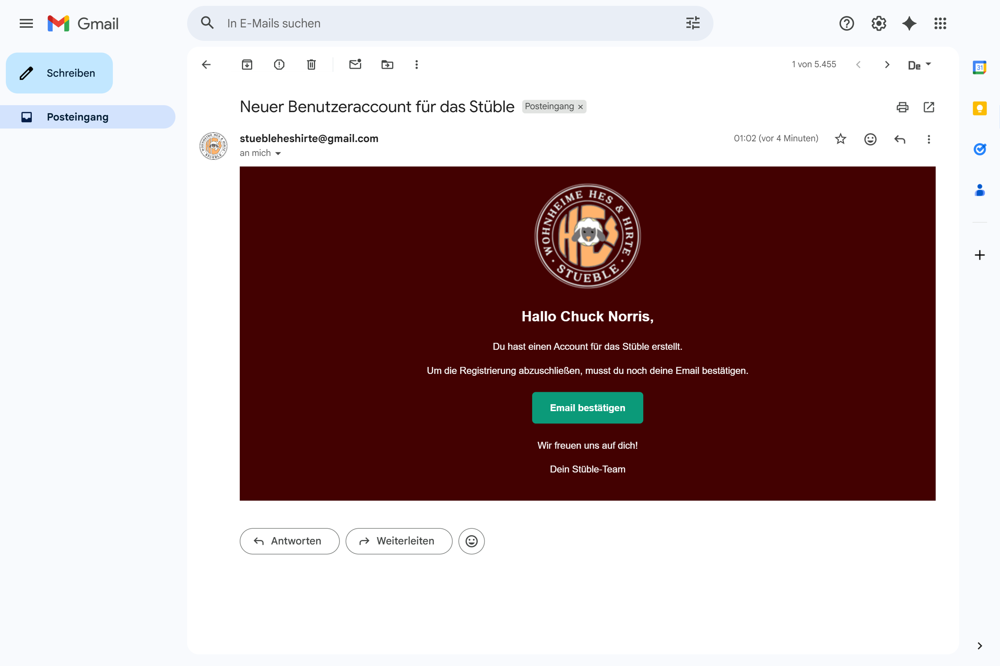

Glückwunsch – Du bist jetzt registriert 🥳

## Zum Stüble anmelden
Wenn Du Dich zu einer Stüble-Feier anmelden willst oder eine Freundin mitnehmen willst, erfährst Du hier, wie du vorgehen musst.

1. Besuche die [Stüble-Website](https://stueble.pages.dev) und melde Dich an. 
Danach wirst Du zur Startseite weitergeleitet.  
Klicke nun auf 📆 Anmelden in der Mitte der Seite. 

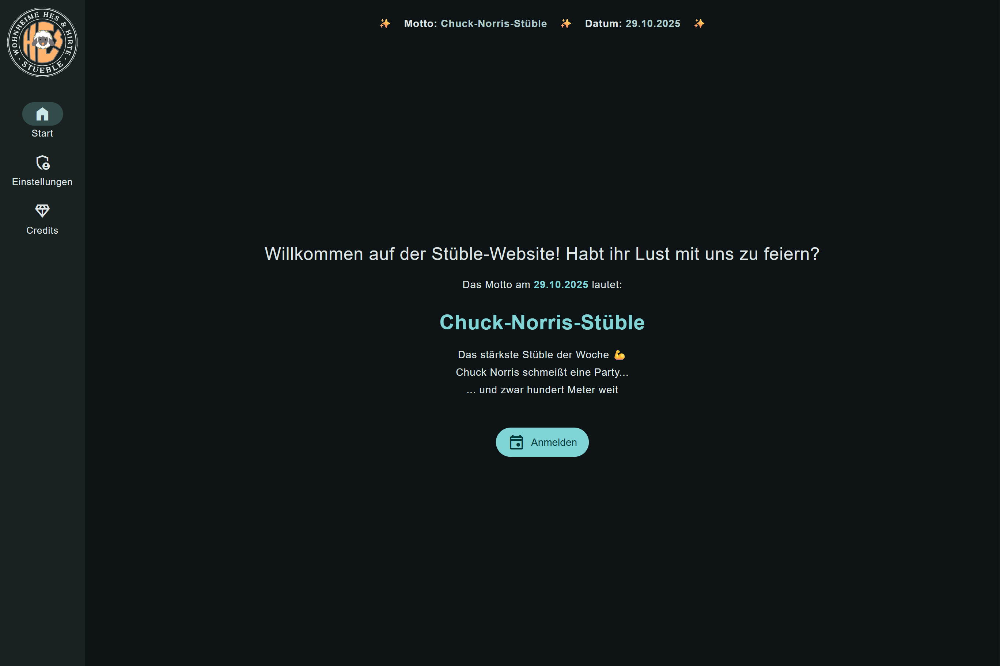

Jetzt bist du zur nächsten Stüble-Feier angemeldet

## Freund*in einladen
Du willst einen Freund oder eine Freundin einladen?  
Wir zeigen Dir, wie das geht.  
WICHTIG: Dein Gast benötigt einen Ausweis, um bei der Stüble-Feier eingelassen zu werden.
* Du kannst nur Freunde einladen, wenn Du selbst zu der Stüble-Feier angemeldet bist.
* Beachte, dass Deine eingeladenen Freunde entfernt werden, wenn Du Dich von der Stüble-Feier abmeldest.
* Als normaler Benutzer kannst du nur eine Person einladen. Falls du mehr Personen einladen willst, wende dich unter tutorenhes+stueble@gmail.com an die Tutoren.
1. Klicke auf den Button Externer Gast. 

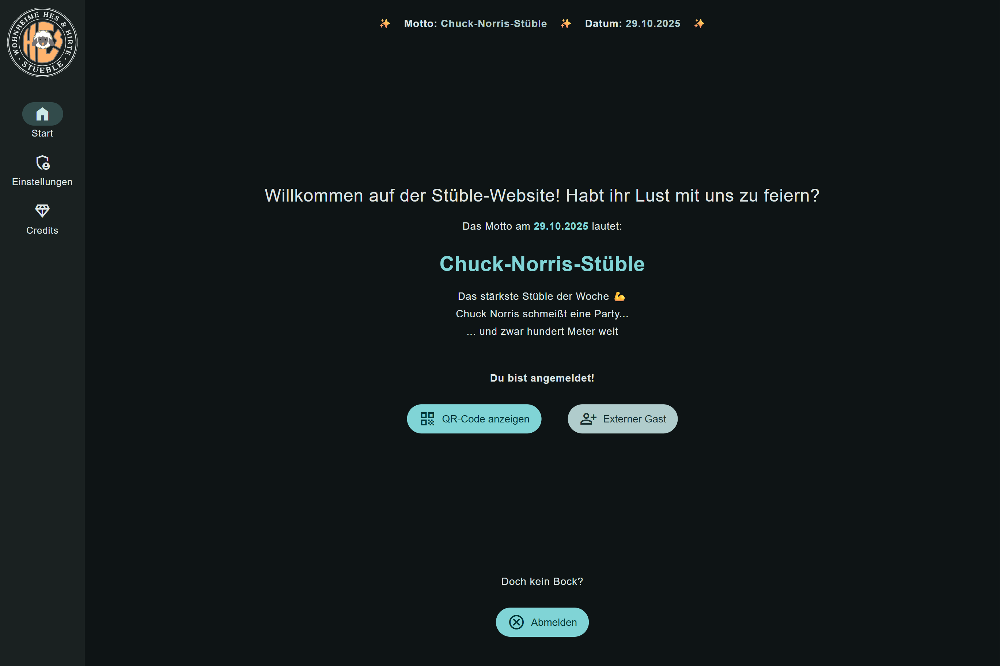   
2. Nun trage Vor- und Nachnamen deines Gastes ein und füge optional eine Email-Adresse des Gastes hinzu. 
Das Angeben einer Email-Adresse wird ausdrücklich empfohlen, da Dein Gast so einen QR-Code zum schnellen Einlassen zur Stüble-Feier erhält. 
Klicke anschließend auf Einladen, 

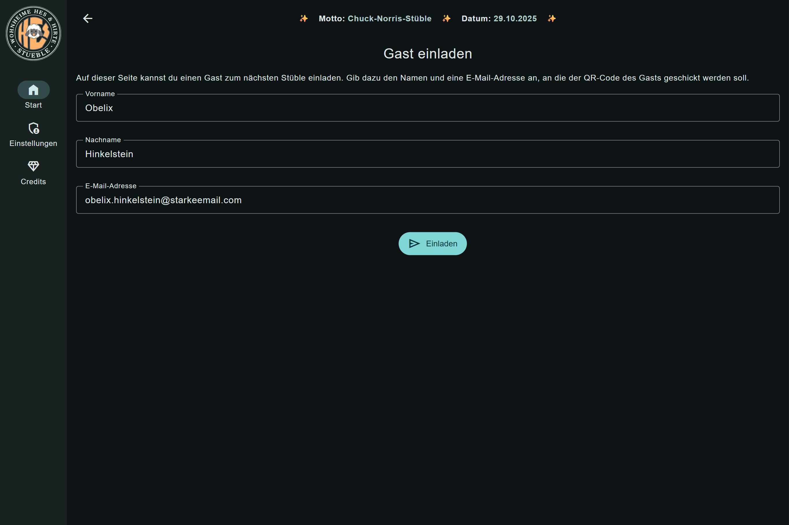
3. Daraufhin erhältst Du ein Pop-Up, das Dir die erfolgreiche Einladung bestätigt.
TODO: BILD EINFÜGEN
4. Falls Du die Email-Adresse Deines Gastes angegeben hast, erhält dieser anschließend eine Email von stuebleheshirte@gmail.com mit einem QR-Code für den Einlass. 

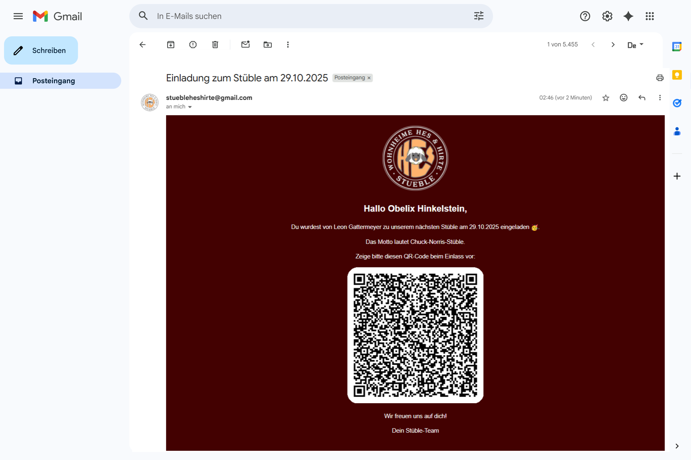

Super – Du hast nun einen Gast eingeladen. 
Bitte weise deinen Gast auf die Email hin. Falls Du keine Email-Adresse angegeben hast, muss Dein Gast seinen Namen beim Einlass nennen.

## Vom Stüble abmelden
Du bist zum Stüble angemeldet, hast aber doch keine Zeit?  
Dann melde Dich in diesem einen Schritt wieder ab.
* Nachdem Du zu einer Stüble-Feier am Eingang eingelassen worden bist, kannst Du Dich nicht mehr abmelden.
1. Klicke auf der [Startseite](https://stueble.pages.dev) auf ❌ Abmelden am Ende der Seite. 

2. Anschließend öffnet sich ein Pop-Up, in dem Du Deine Abmeldung bestätigen musst. 

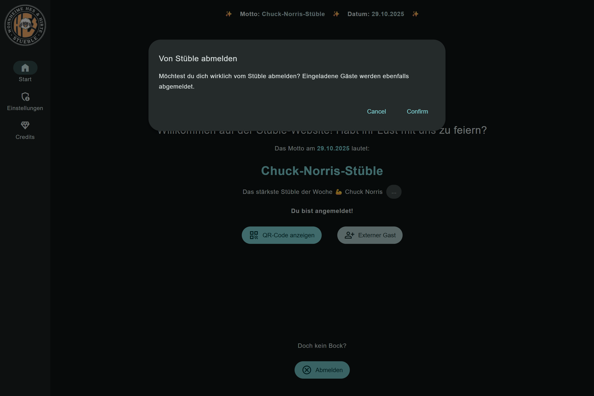

 Du und deine eingeladenen Gäste sind nun von der Stüble-Feier abgemeldet.

# Einlass
Um in das Stüble zu gelangen, musst du den Einlass durchlaufen. Bitte nehme hierzu bei deinem ersten Besuch deinen Ausweis mit.  

### Einlass für Bewohner des HES
Um durch den Einlass zu gelangen, musst du einen QR-Code vorzeigen.  
Du kannst Dir den QR-Code auf der Website anzeigen lassen, nachdem Du Dich für die Stüble-Feier angemeldet hast.  
1. Klicke hierzu auf QR-Code anzeigen. 

2. Daraufhin öffnet sich ein Pop-Up mit dem QR-Code. Zeige diesen bitte beim Betreten des Stübles am Haupteingang vor, um ein Einlassbändchen zu erhalten. Nur mit diesen ist der Kauf von Getränken möglich. 

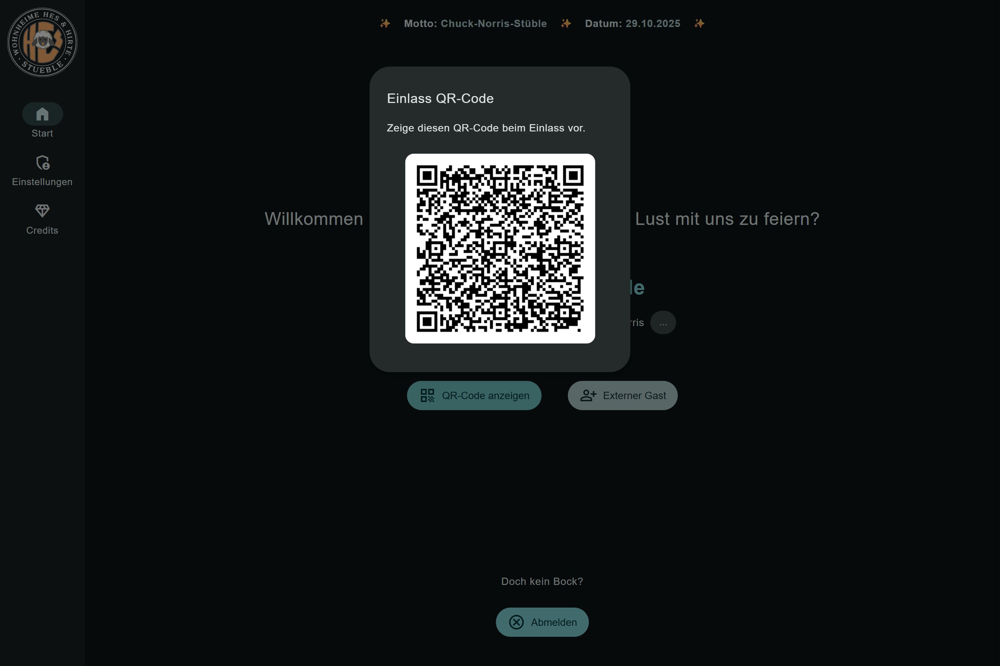

Grandios – Nun bist Du bereit, Deine Zeit im Stüble zu genießen.

### Einlass für externe Gäste
WICHTIG: Du benötigst Deinen Ausweis, um zum Stüble eingelassen zu werden.  
Als externer Gast bekommst Du einen QR-Code per Email zugesendet (falls die Email-Adresse bei der Einladung angegeben wurde).  
Die Email stammt von stuebleheshirte@gmail.com.  
Bitte zeige den QR-Code beim Einlass zum Stüble vor. 

 

Falls keine Email-Adresse bei der Einaldung angegeben wurde, musst du beim Einlass deinen Namen nennen.   
Jetzt kannst Du das Stüble in vollen Zügen genießen.

## Einstellungen
Um zu deinen Einstellungen zu gelangen, klicke auf der linken Seite im Menü auf den Button Einstellungen. 

 
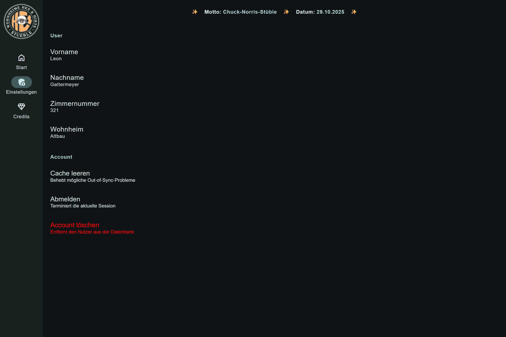 

 
Hier siehtst Du deine Account-Daten. 
* Falls Probleme auftreten kannst Du hier mit einem Klick auf Cache leeren einige Probleme beheben.
* Du kannst Dich auch unter Abmelden von deinem Account abmelden oder ihn unter Account löschen löschen.

## Kontakt
Falls Du Fragen hast, Dir ein Fehler aufgefallen ist oder Du Hilfe benötigst, wende Dich bitte an diese Email-Adresse: tutorenhes+stueble@gmail.com
